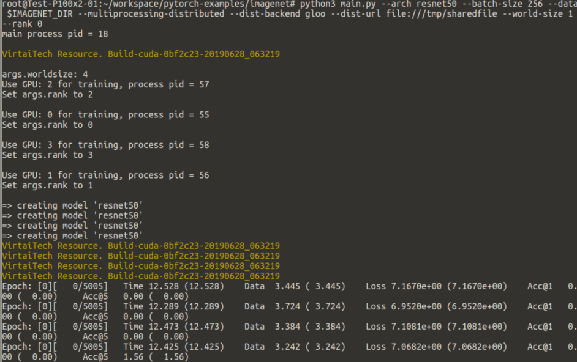
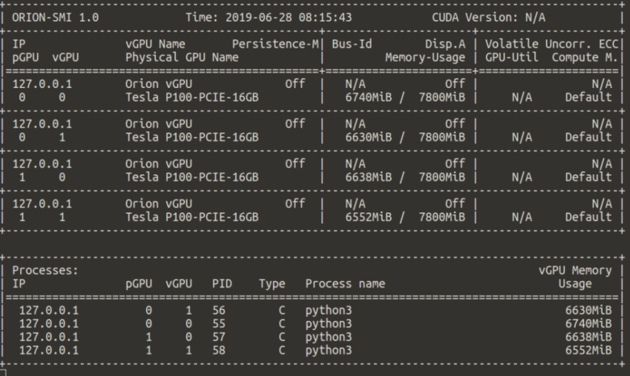
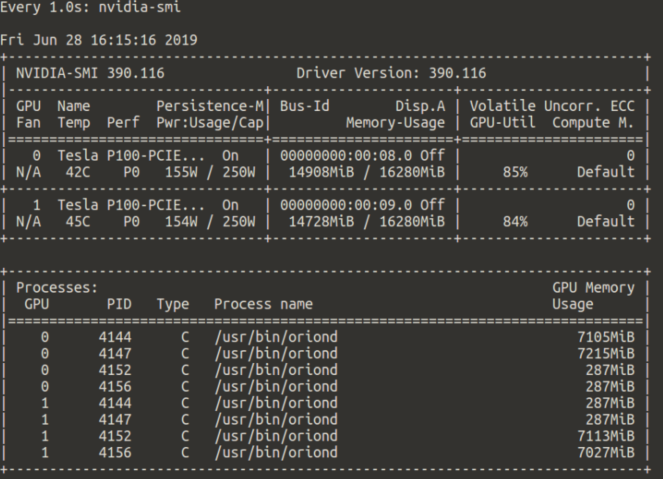

# PyTorch 使用Orion vGPU

我们假定用户在阅读本文之前，已经阅读过Quick Start部分的[Docker容器章节](../doc/quick-start/container.md)，对于在容器环境中使用Orion vGPU软件有基本的了解。

我们推荐用户在我们准备的Orion Client容器内部运行PyTorch模型

```bash
docker pull virtaitech/orion-client:pytorch-1.1.0-py3
```

运行容器之前，用户需要保证Orion Controller和Orion Server正常运行。运行容器时，需要将`orion-shm`工具创建的`/dev/shm/orionsock<index>`挂载进容器内的同一路径。用户还需要设置正确的`ORION_CONTROLLER`环境变量。

<a id="run-container"></a>**容器内使用PyTorch Multiprocessing**

为了在容器中使用PyTorch的Multiprocessing模块，包括PyTorch DataLoader，用户需要增大容器所能使用的共享内存最大值。为此，`docker run`时需要加上

```bash
--ipc=host
```
或者
```bash
--shm-size=8G
```
参数。这一要求与Orion vGPU软件无关，即使通过`nvidia-docker`使用本地物理GPU也是需要的。关于这一点，用户可以参见[NVIDIA官方PyTorch镜像说明](https://docs.nvidia.com/deeplearning/frameworks/pytorch-release-notes/running.html)。

**在KVM虚拟机或者裸物理机运行PyTorch使用Orion vGPU**

如果用户要在非容器环境中安装PyTorch以及Orion Client Runtime以使用Orion vGPU资源，建议用户将Orion Client运行时安装到`/usr/local/cuda-9.0`，并创建软链接`/usr/local/cuda => /usr/local/cuda-9.0`:

```bash
mkdir -p /usr/local/cuda-9.0
./install-client -d /usr/local/cuda-9.0
ln -s /usr/local/cuda-9.0 /usr/local/cuda
```

此外，用户可能需要

## 支持情况
Orion vGPU对PyTorch的支持还在持续开发中。目前，我们支持PyTorch 1.0.1和1.1.0版本。

需要注意的是
* Orion vGPU目前不支持PyTorch通过RDMA网络使用远程GPU资源
* 使用多卡训练时，需要用GLOO作为后端，而不是默认的NCCL后端

## [PyTorch官方模型例子](https://github.com/pytorch/examples)

本节中，我们介绍Orion vGPU对官方模型例子的支持情况。

* [DCGAN](https://github.com/pytorch/examples/tree/master/dcgan) 支持单块Orion vGPU
  
    GitHub上页面建议使用的lsun bedroom数据集有42GB，下载较慢，用户可以选择[Celeb-A Faces dataset](http://mmlab.ie.cuhk.edu.hk/projects/CelebA.html)，下载其中的`img_align_celeba.zip`。下载后，用户应创建目录`celeba`，然后将压缩包解压至目录下。此时，目录结构为

    ```bash
    path/to/celeba
        -> img_align_celeba
            -> 000001.jpg
            -> 000002.jpg
                ...
    ```

    用户可以用`--dataset lfw --dataroot=path/to/celeba`参数使用解压后的数据集进行训练。由于我们目前只支持单块Orion vGPU，用户需要加上`--ngpu 1`参数：
    ```bash
    python3 main.py --dataset lfw --dataroot /path/to/celeba --cuda --ngpu 1
    ```

* [Neural Stype Transfer](https://github.com/pytorch/examples/tree/master/fast_neural_style) 支持

    用户应当用`--cuda 1`参数指定使用Orion vGPU训练模型。否则，模型会用CPU训练。

* [Imagenet](https://github.com/pytorch/examples/tree/master/imagenet) 支持使用GLOO后端进行多Orion vGPU上的模型训练
  
    当用户设置`ORION_VGPU`值大于1时，PyTorch默认使用NCCL后端进行多卡训练，而Orion vGPU软件暂时不支持NCCL通信计算库。因此，如果用户只想用单Orion vGPU进行训练，应当在运行`main.py`时明确指定：
    ```bash
    python3 main.py --arch resnet50 --batch-size 128 --data $IMAGENET_DIR --gpu 0
    ```

    如果用户需要使用多Orion vGPU进行训练，应当指定使用Facebook [GLOO](https://github.com/facebookincubator/gloo)后端。以使用2块Orion vGPU为例：

    ```bash
    python3 main.py --arch resnet50 \
        --batch-size 256 \
        --data $IMAGENET_DIR \
        --multiprocessing-distributed \
        --dist-backend gloo \
        --dist-url file:///tmp/sharedfile \
        --world-size 1 \
        --rank 0
    ```

    上述命令中，
    * `--world-size 1 --rank 0`表示在每个Orion vGPU上都会启动一个向Orion vGPU发送CUDA API请求的工作进程
    * `--batch-size 256`是两块Orion vGPU上的总batch_size，因此单卡的batch_size为128
    * `--dist-backend gloo`表明使用GLOO作为多卡训练的通信计算后端
    * `--dist-url file:///tmp/sharedfile`指GLOO启动的每个工作进程之间初始化时用`/tmp/sharedfile`文件进行交互metadata。用户也可以选择TCP方式进行。

    需要注意的是，启动容器时一定要带上[本文开头](#run-container)所介绍的参数
    ```bash
    --ipc=host
    # (or) --shm-size=8G
    ```
    以保证容器内部的DataLoader Worker进程之间可以通过共享内存交换数据。

* [MNIST Convnets](https://github.com/pytorch/examples/tree/master/mnist) 支持
* [MNIST Hogwild](https://github.com/pytorch/examples/tree/master/mnist_hogwild) 暂不支持，对CUDA IPC的全面支持还在开发阶段。
* [Linear Regression](https://github.com/pytorch/examples/tree/master/regression) 支持
* [Reinforcement Learning](https://github.com/pytorch/examples/tree/master/reinforcement_learning) 支持
* [SNLI with GloVe vectors and LSTMs](https://github.com/pytorch/examples/tree/master/snli) 支持

    用户需要安装`spacy`，并下载语料集：
    ```bash
    pip3 install spacy
    python3 -m spacy download en
    ```
* [Super Resolution](https://github.com/pytorch/examples/tree/master/super_resolution) 提供的容器内不支持，因为编译时没有带上Lapack支持。
* [Time Sequence Prediction](https://github.com/pytorch/examples/tree/master/time_sequence_prediction) 支持
* [Variational Auto-Encoders](https://github.com/pytorch/examples/tree/master/vae) 支持
* [Word Language Model using LSTM](https://github.com/pytorch/examples/tree/master/word_language_model) 支持

## 多卡训练Resnet50模型示例

本节中，我们展示一个有趣的场景：将两块本地Tesla P100 16GB计算卡虚拟化成4块Orion vGPU用于在Imagenet数据集上训练Resnet50模型。我们在Orion Client内的资源申请环境变量为`ORION_VGPU=4`，`ORION_GMEM=7800`，这样可以保证每两块Orion vGPU位于一块Tesla P100计算卡上。

注：从性能的角度，应该将ORION_GMEM设置为较大值，例如`ORION_GMEM=15500`，相当于独占一张Tesla P100物理卡。这里我们将一块物理卡分为两块Orion vGPU，目前是为了展示和证明Orion vGPU软件的特性。

我们假定Orion Controller和Orion Server处于正常运行状态，用户已经用`orion-shm`工具创建了`/dev/shm/orionsock0`共享内存。此外，防火墙设置允许容器访问9123, 9960, 9961端口。

我们的Imagenet原始数据放在`/data/ImageNet_ILSVRC2012`里，挂载到容器内部（根据[模型要求](https://github.com/pytorch/examples/tree/master/imagenet)，用户需要先将Imagenet validation目录下的图片移到1000个子目录）。

```bash
IMAGENET_DIR=/data/ImageNet_ILSVRC2012
docker run -it --rm \
    --shm-size 8G \
    --net host \
    -v /dev/shm/orionsock0:/dev/shm/orionsock0:rw \
    -v $IMAGENET_DIR:/root/imagenet_dir \
    -e ORION_CONTROLLER=127.0.0.1:9123 \
    -e ORION_VGPU=4 \
    -e ORION_GMEM=7800 \
    virtaitech/orion-client:pytorch-1.1.0-py3
```

根据上一节所述，我们需要用GLOO作为后端运行模型：

```bash
# (git clone pytorch models repo)
git clone https://github.com/pytorch/examples.git
cd examples/imagenet

# (train with GLOO backend)
python3 main.py --arch resnet50 \
    --batch-size 256 \
    --data /root/imagenet_dir \
    --multiprocessing-distributed \
    --dist-backend gloo \
    --dist-url file:///tmp/sharedfile \
    --world-size 1 \
    --rank 0
```

总batch_size为256，每块Orion vGPU上batch_size为64。PyTorch识别出4块Orion vGPU设备，每块Orion vGPU上启动一个工作进程。



我们可以新开一个terminal接入此容器，用`orion-smi`工具展示Orion vGPU使用情况（容器内是UTC时间）



可以看到，容器内使用了四块Orion vGPU，均来自127.0.0.1，`<pGPU, vGPU>`序号对分别为`<0, 1>, <0, 0>, <1, 0>, <1, 1>`。`orion-smi`工具输出的PID和PyTorch日志中显示的PID是一致的。

我们在物理机操作系统上运行NVIDIA的`nvidia-smi`工具监视实际物理GPU使用情况：



可以看到，实际的计算任务被Orion Server进程`oriond`完全接管。

用户或许会发现，`orion-smi`汇报的显存使用少于`nvidia-smi`汇报的实际物理显存使用，这是因为`orion-smi`工具目前只汇报堆上分配的显存，没有计入CUDA context、cuDNN等隐式占用的显存开销。

经过7个epoch后，我们的训练达到49.362% top-1精度，75.680% top-5精度。

## 常见问题

* ERROR: Unexpected bus error encountered in worker. This might be caused by insufficient shared memory (shm)

    此错误（以及某些出现在`dataloader.py`中的错误）是由于DataLoader进程所需的共享内存大小超过了容器启动时的限制。参见[本文开头](#run-container)重新启动容器。