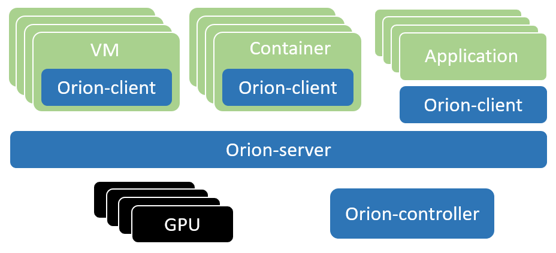

# 概述
Orion vGPU软件是一个为云或者数据中心内的AI应用，CUDA应用提供GPU资源池化，提供GPU虚拟化能力的系统软件。通过高效的通讯机制，使得AI应用，CUDA应用可以运行在云或者数据中心内任何一个物理机，Container或者VM内而无需挂载物理GPU。同时为这些应用程序提供在GPU资源池中的硬件算力。通过这种Orion GPU池化的能力，可以提供多个优点：
* 兼容已有的AI应用和CUDA应用，使其仍然具有使用GPU加速的性能
* 为AI应用和CUDA应用在云和数据中心的部署提供了很大的灵活度。无需受GPU服务器位置、资源数量的约束。
* Orion GPU资源随AI应用和CUDA应用启动时分配，随应用程序退出时自动释放。减少GPU空闲时间，提高共享GPU的周转率。
* 通过对GPU资源池的管理和优化，提高整个云和数据中心GPU的利用率和吞吐率。
* 通过统一管理GPU，减轻GPU的管理复杂度和成本。

# 支持列表

## 处理器
* x86_64

## 操作系统
* 64位 Ubuntu 18.04 LTS，16.04 LTS, 14.04 LTS
* 64位 CentOS 7.x

## NVIDIA GPU
* NVIDIA T4, RTX 2080 Series
* NVIDIA V100
* NVIDIA P100, P40, P4, GTX 1080 Series, GTX 1060 Series
* Nvidia K80，Nvidia K40

## NVIDIA CUDA
* CUDA 10.1
* CUDA 10.0
* CUDA 9.2
* CUDA 9.1
* CUDA 9.0
* CUDNN 7.4.2 及以上

## 深度学习框架
* TensorFlow 2.0, TensorFlow 1.8 - 1.14
* Pytorch 1.0 - 1.3
* PaddlePaddle 1.5.2
* NVCaffe

## 网络
* Mellanox Connect-X4 RoCE，Mellanox Connect-X5 RoCE
* TCP以太网络

## 容器环境
* Docker 1.13 及以后版本

## 虚拟化环境
* QEMU-KVM (QEMU 2.x)

## 容器框架
* Kubernetes 1.10 及以后版本

# 已知问题
下面列出当前版本不支持的CUDA库、工具以及使用模式
* 不支持CUDA应用程序使用 Unified Memory
* 不支持 nvidia-smi 工具
* 不支持OpenGL相关接口，不支持图形渲染相关接口
* 在使用Mellanox网卡的RDMA模式时，不支持Pytorch框架
* 有限支持CUDA IPC，对部分程序可能不支持。
* 部分应用需要从源码重新编译以保证动态链接 CUDA 库。

# 组件介绍

## Orion Client
该组件为一个运行环境，其模拟了NVidia CUDA的运行库环境，为CUDA程序提供了API接口兼容的全新实现。通过和Orion其他功能组件的配合，为CUDA应用程序虚拟化了一定数量的虚拟GPU（Orion vGPU）。  
使用CUDA动态链接库的CUDA应用程序可以通过操作系统环境设置，使得一个CUDA应用程序在运行时由操作系统负责链接到Orion Client提供的动态链接库上。由于Orion Client模拟了NVidia CUDA运行环境，因此CUDA应用程序可以透明无修改地直接运行在Orion vGPU之上。

## Orion Controller
该组件为一个长运行的服务程序，其负责整个GPU资源池的资源管理。其响应Orion Client的vGPU请求，并从GPU资源池中为Orion Client端的CUDA应用程序分配并返回Orion vGPU资源。  
该组件可以部署在数据中心任何网络可到达的系统当中。每个资源池部署一个该组件。资源池的大小取决于IT管理的需求，可以是整个数据中心的所有GPU作为一个资源池，也可以每个GPU服务器作为一个独立的资源池。

## Orion Server
该组件为一个长运行的系统服务，其负责GPU资源化的后端服务程序。Orion Server部署在每一个物理GPU服务器上，接管本机内的所有物理GPU。通过和Orion Controller的交互把本机的GPU加入到由Orion Controller管理维护的GPU资源池当中。  
当Orion Client端应用程序运行时，通过Orion Controller的资源调度，建立和Orion Server的连接。Orion Server为其应用程序的所有CUDA调用提供一个隔离的运行环境以及真实GPU硬件算力。

# 典型部署架构
以下介绍两种常见的Orion GPU资源池化部署方案。一种是All-in-One的本地GPU虚拟化方案，一种是部署到分布式多台物理机的GPU资源池化方案。

## 本地GPU虚拟化方案


本地虚拟化GPU方案指的是一个GPU物理机本身作为一个独立的GPU资源池，并且仅向本机内部的CUDA应用程序，本机内部Container里面的CUDA应用程序，以及本机内部VM虚拟机里面的CUDA应用程序提供虚拟化GPU的一种部署方式。  
如上图所示，该部署方案把Orion的三个功能组件Client，Controller和Server都安装部署到一个GPU物理机里。各个组件通过本机内部的网络配置，例如127.0.0.1，或者Container虚拟网络，VM虚拟网络连接通讯。   
Orion Client端可以部署在本地物理机上，Container里，或者VM里，从而支持CUDA应用程序无修改透明地运行在本地物理机上，Container里，或者VM里。   
该方案的与传统的设备虚拟化方案类似，通过Orion实现GPU的虚拟化，使得多个Container或者多个VM可以共享本机的一个或者多个物理GPU。其次该方案不需要高性能的RDMA网卡支持就可以获得较好的性能。

**尽管该方案支持CUDA应用程序运行在 本机/Container/VM 三种Orion Client环境中，但是同一时刻的配置仅对其中一种Orion Client生效。因此请勿同时使用多种Orion Client环境。如欲切换不同的Orion Client环境，需要停止上一种Orion Client环境中所有的CUDA应用程序，并且修改相应的配置后重启Orion Server服务。**

## 分布式GPU资源池化方案


分布式GPU资源池化方案指的是把一台或者多台服务器内的GPU作为资源池，通过Orion向局域网内任一个物理机、Container或者VM内的CUDA应用程序提供虚拟化GPU的部署方式。  
如上图所示，该部署方案在每一个GPU服务器上部署Orion Server服务。在每一个需要运行CUDA应用程序的物理机、Container和VM里部署Orion Client运行库。选择网络上至少一个Linux服务器部署Orion Controller。该Controller必须可以被属于同一个资源池的Orion Server以及希望使用该资源池的Orion Client通过网络访问。  
在每一个Orion Server环境和每一个Orion Client环境中都需要配置该Orion Controller的地址信息，使其在运行中可以通过Orion Controller请求vGPU资源，响应请求等。   
在如图2所示的部署方案中，使用了control plane和data plane两套网络。其中control plane用于和Orion Controller组件的通讯。该部分通讯流量不大，对网络延迟和带宽需求不高。data plane用于Orion Client和Orion Server之间执行CUDA任务之间的通讯。该部分对于网络的延迟和带宽有一定需求。建议使用支持RDMA的网络。

# 安装部署

本文介绍在宿主机上部署 Orion vGPU 软件各组件的方法。

有需求的读者也可以参考 [基于 Kubernetes 的全容器化部署方案](../orion-kubernetes-deploy)。

我们假定读者已经将 [GitHub repo](https://github.com/virtaitech/orion) 克隆到了本地：

```bash
git clone https://github.com/virtaitech/orion

cd orion
```

## 部署Orion Controller
### 环境依赖
* Linux Centos 7.x / Ubuntu 14.04 LTS 及以上版本

### 启动Orion Controller服务

```
cd orion-controller

./orion-controller start --config-file controller.yaml
```

### 配置Orion Controller服务
Orion Controller 在配置文件 `controller.yaml` 中接受以下参数：

  - listen_ip: 建议监听在 0.0.0.0 上，以适应各种网络环境
  - listen_port: 监听端口，默认为 9123
  - log_file: 日志文件，如果设为 "null" 字符串，日志将输出到屏幕

此外，配置文件中的 database 部分可以配置 Orion Controller 自带 etcd 数据库的存储路径，以及服务的URL及端口。当用户环境中已经有 etcd 服务（例如 k8s 集群中）时，为了不与现有服务冲突，用户可以根据情况修改这些配置。

## 部署Orion Server

### 宿主机环境依赖
* NVIDIA CUDA SDK 9.0, 9.1, 9.2, 10.0, 10.1
* NVIDIA CUDNN 7.4.2 以上版本，推荐 7.6.x
* g++ 4.8.5 或以上版本，libcurl，openssl, libibverbs

#### 多版本 CUDA SDK 共存

Orion Server 要求 CUDA 安装在宿主机默认路径（即 `/usr/local/cuda-x.y`）下面。

Orion Server 支持宿主机上多 CUDA 版本共存，只要它们均安装在默认路径即可。例如，当 CUDA 9.0, CUDA 10.0 共存时，`/usr/local` 目录下应该有 `cuda-9.0` 和 `cuda-10.0` 这两个目录。

此外，多 CUDA 版本共存时，不需要设置 `CUDA_HOME`，`LD_LIBRARY_PATH` 等环境变量，也不依赖于部分用户环境中存在的软链接 `/usr/local/cuda => /usr/local/cuda-x.y`，这是因为 Orion Server 可以根据 Orion Client 环境中实际安装的 Runtime 对应于 CUDA 的版本号，动态选择合适的 CUDA SDK 版本。

### 可选依赖
根据支持不同使用场景，对不同软件的依赖包括：
* RDMA支持：MLNX_OFED_LINUX-4.5驱动及用户库
* 本地虚拟机支持：libvirt >= 1.3，QEMU >= 2.0

### 软件安装

```
cd orion-server

sudo ./install-server.sh
```

安装脚本会将 Orion Server 注册成由 systemctl 管理的系统服务。

### 配置Orion Server
大部分配置均可使用默认配置，少量配置需要根据使用场景进行编辑配置

编辑配置文件 `/etc/orion/server.conf`

* controller_addr：Orion Controller 的IP地址
    * 对于上述本地GPU虚拟化方案，可以试用本地回环地址，例如为 127.0.0.1:9123
    * 对于上述的分布式GPU资源池化方案，则应该是Orion Controller在整个局域网的可访问地址

* bind_addr：Orion Server 的 data plane 的IP地址。
    * 对于上述本地GPU虚拟化方案，如果目标支持Docker Container，则应该是Docker虚拟网络的网关地址。通常为docker0网络接口的IP地址。如果目标支持VM，则应该是VM的虚拟网关的本机IP地址。
    * 对于上述的分布式GPU资源池化方案，如果仅具备TCP以太网网卡，则该地址为TCP以太网网卡的IP地址。如果配置试用RDMA网络，则配置为RDMA网卡的IP地址。

* enable_shm：启用基于共享内存的通讯加速机制
    * 对于上述本地GPU虚拟化方案，如果目标应用程序运行在Docker Container或者QEMU-KVM的VM里，则设为true。否则设置为false
    * 对于上述的分布式GPU资源池化方案，设置为false
    * 更多关于基于共享内存的通讯加速的内容请看看章节 “SHM通讯加速”

* enable_rdma：RDMA 开关
    * 对于上述本地GPU虚拟化方案，设置为false
    * 对于上述的分布式GPU资源池化方案，如果本机具备RDMA网络条件，则配置为true，否则为false

* enable_kvm：支持QEMU-KVM的VM
    * 对于上述本地GPU虚拟化方案，如果目标应用程序运行在QEMU-KVM的VM里，则设置为true，否则为false
    * 对于上述的分布式GPU资源池化方案，设置为false

* vgpu_count：每个物理GPU切片为多少个vGPU
    * 该参数合法的取值是1~100的任意整数
    * 该参数会影响到默认每个vGPU的显存大小

* comm_id: 支持 NCCL 所需要的端口

### 启动Orion Server
通过如下命令可以启动Orion Server
```
sudo systemctl start oriond
```
通过如下命令可以执行其他Orion Server操作
```
sudo systemctl stop oriond      ## 停止Orion Server服务
sudo systemctl restart oriond   ## 重启Orion Server服务
sudo systemctl status oriond    ## 查看Orion Server服务状态
sudo systemctl enable oriond    ## 添加Orion Server服务到开机启动服务
sudo systemctl enable oriond    ## 添加Orion Server服务到开机启动服务
sudo journalctl -u oriond       ## 查看Orion Server的服务日志
```

### Orion Server日志
Orion Server的日志分为系统日志和用户日志两类
* Orion Server系统日志位于 `/var/log/orion/server.log`。记录Orion Server的服务日志。
* Orion Server用户日志位于 `/var/log/orion/session/` 目录。每次CUDA应用运行均会在该目录产生一个对应于该次任务的日志文件。

## 部署 Orion Client

### 环境依赖
* g++ 4.8.5 或以上版本，libcurl，openssl，libuuid

### 可选依赖
* RDMA支持：MLNX_OFED_LINUX-4.5驱动及用户库

### 软件安装

**注：建议在容器或虚拟机中安装，或者在没有 GPU 环境的物理机上安装，以免破坏本地的 CUDA 环境**

把Orion安装包内的`install-client-x.y` (根据所需 CUDA 版本选择对应的 installer，例如`install-client-10.0` 对应于 CUDA 10.0)拷贝至目标环境，并以Root权限运行。

``` bash
sudo ./install-client-x.y
```

上述命令把 Orion Client 环境安装至默认路径 `/usr/lib/orion` 中，并通过 `ldconfig` 机制将 `/usr/lib/orion` 添加到系统动态库搜索路径。

此外，可以指定其它安装选项进行安装

    -d  指定安装路径。默认值为 `/usr/lib/orion`
    -q  静默安装。安装过程中跳过输入提示

无论是否默认安装，由于 `LD_LIBRARY_PATH` 的优先级高，我们建议用户设置

```bash
export LD_LIBRARY_PATH=<installation-path>
```

以确保应用程序链接到 Orion Client Runtime。

### 配置Orion Client
Orion Client可以通过三类方法配置运行参数

* 通过环境变量配置运行参数
* 通过当前用户home目录中 {$HOME}/.orion/client.conf 配置文件配置运行参数
* 通过 /etc/orion/client.conf 配置文件配置运行参数

**上述方法中，通过环境变量配置的优先级最高，系统 `/etc/orion` 目录中配置文件的优先级最低**

Orion Client的配置中分为静态配置部分和动态配置部分。
* 静态配置部分指的是在目标环境中每次运行CUDA应用程序都保持不变的部分。
* 动态配置部分指的是根据CUDA应用程序使用的Orion vGPU资源不同而不同的配置。

静态配置参数可以通过上述三类方法进行参数配置，而动态配置部分仅能通过环境变量进行参数配置   
静态配置大部分可以使用默认值，少量配置需要修改。包括：

* 环境变量 ORION_CONTROLLER 设置 Orion Controller 的地址
    * 例如通过 export ORION_CONTROLLER=127.0.0.1:9123 指向一个监听在本地9123端口的 Orion Controller
* 配置文件参数 shm_path_base 指定内存文件系统的路径
    * 在本地GPU虚拟化方案中，如果目标环境是Container环境，且Orion Server开启了enable_shm支持，则在Orion Client环境中需要指定该路径。
* 配置文件参数 controller_addr 指定 Orion Controller 的地址
    * 该参数作用等同于环境变量 ORION_OCNTROLLER 。但优先级较低

动态配置包括：
* 环境变量 ORION_VGPU 设置当前环境下 CUDA 应用程序申请使用多少个 Orion vGPU
    * 例如通过 export ORION_VGPU=2 指定了当前 CUDA 应用程序申请使用 2 个Orion vGPU
    * 该配置无默认值
* 环境变量 ORION_GMEM 设置当前环境下，CUDA 应用程序申请使用的每个 Orion vGPU 中的显存大小。以MiB为单位。
    * 例如通过 export ORION_GMEM=4096 为当前 CUDA 应用程序指定了每个 Orion vGPU的显存大小为 4096 MiB。
    * 该配置的默认值取决于Orion Controller的配置

**更多关于Orion vGPU的配置请参看后面章节 “Orion vGPU的使用”**

### Orion Client日志
Orion Client日志位于执行应用程序的用户home目录中的 `${HOME}/.orion/log` 目录中。每次CUDA应用运行均会在该目录产生一个对应于该次任务的日志文件。


# 使用Orion vGPU
本章节介绍在Orion Client环境中，如何为CUDA应用程序配置使用Orion vGPU

## Orion vGPU资源
通过安装部署Orion vGPU软件，所有Orion Server所在的GPU服务器内的GPU均加入了一个全局共享的资源池。每个物理GPU均被划分为多个逻辑vGPU。划分vGPU的粒度为启动 Orion Server 时，配置文件 `/etc/orion/server.conf` 中的 `vgpu_count` 参数指定。若设置 `vgpu_count=n`，则每个vGPU默认的显存大小为物理GPU显存的 n 分之一。

## Orion vGPU的使用
由于Orion vGPU的调用接口兼容物理GPU的调用接口，因此CUDA应用程序可以无感知无修改地像使用物理GPU那样使用Orion vGPU。仅需要在运行CUDA应用程序时，通过配置文件、环境变量为本CUDA应用程序配置运行环境即可。   

经过Orion GPU资源池化之后，资源池中的vGPU使用模式为CUDA应用程序即时申请即时使用的模式。也即是当CUDA应用程序调用CUDA接口初始化时才向Orion GPU资源池申请一定数量的vGPU，当CUDA应用程序退出时其申请到的vGPU自动释放至资源池中。多次调用CUDA应用程序分配到的vGPU不一定对应于同样的物理GPU资源。 

当Orion Client的静态环境配置完毕后，在运行一个CUDA应用之前，至少需要用 ORION_VGPU 环境变量指明该CUDA应用程序希望获得的vGPU数目。例如一个deviceQuery CUDA程序，如下的命令使得当该CUDA程序做设备发现时，通过CUDA的接口查询到2个GPU，每个GPU的显存是4096MiB。
```
export ORION_VGPU=2
export ORION_GMEM=4096
./deviceQuery
```
当上述deviceQuery CUDA程序启动时，会从Orion GPU资源池中独占两个vGPU。该程序结束时，会自动释放两个vGPU。可以通过重新设定环境变量，在运行CUDA应用程序之前改变对vGPU资源的使用。**一次CUDA应用程序所申请的多个vGPU可能存在于多个物理GPU上。**

**vGPU的使用对象为CUDA应用程序，而非物理机、Container或者VM虚拟机。即使在同一个环境下运行的多个CUDA应用程序，每一个应用程序都按照当前的运行环境向Orion GPU资源池申请独立的vGPU资源。如果并行运行多个CUDA应用程序，则消耗的vGPU数量为应用程序数目乘以 ORION_VGPU 所指定的vGPU数目。**

# SHM 通讯加速
对于本地GPU虚拟化方案，由于 Orion Server 和 Orion Client 都在同一个物理机器上，Orion支持使用基于共享内存的通讯加速——SHM通讯加速。

## SHM 通讯加速配置

### Orion Server 配置

首先需要在配置文件 `/etc/orion/server.conf` 中设置 `enable_shm = true` 。

此外，需要根据需要加速的 Orion Client 是否运行在 KVM 虚拟机中，设置 `enable_kvm` 项：

- Orion Client 端运行在 KVM 虚拟机中：在 `/etc/orion/server.conf` 设置 `enable_kvm = true`

- Orion Client 端运行在 Docker 容器中：在 `/etc/orion/server.conf` 设置 `enable_kvm = false`

## CUDA应用程序运行在 Container 中

对于社区版本的 Orion vGPU 软件，只需要让容器工作在 `ipc host` 模式下，即可自动支持使用 SHM 加速。

具体地：

- 对于 `docker run` 方式启动容器，需要加上 `--ipc host` 参数；

- 对于 Kubernetes 启动的容器 Pod，需要在 `.yaml` 配置文件中指定 `hostIPC: true`。

  （可参见我们提供的 [`deploy-client.yaml`](../orion-kubernetes-deploy/deploy-client.yaml)）

## CUDA应用程序运行在基于 QEMU-KVM 的虚拟机中

本使用场景中，不需要手动维护SHM设备。只要 Orion Server 配置正确，即可使用 SHM 加速。

# 故障排查

Orion vGPU软件提供了健康检查的工具 `orion-check` 来帮助用户在各个阶段下检测环境和排查故障。包括在安装部署之前检查环境配置以及在运行启动过程中检查故障。

`orion-check` 工具在克隆的 repo 中的 `orion-server` 目录下可以找到。安装 Orion Server 时会将它拷贝到 `/usr/bin` 路径下。安装 Orion Client Runtime 时，安装包也会将它放到 容器或虚拟机中的 `/usr/bin` 路径下。

## 在安装部署之前检查环境兼容性

* 检查安装Orion Controller的环境

```bash
    orion-check install controller
```

* 检查安装Orion Server的环境

```bash
    orion-check install server
```

* 检查安装Orion Client的环境

```bash
    orion-check install client
```

## 在安装部署之后检查运行时的健康状况

* 检查Orion Server的运行状态

```bash
    sudo orion-check runtime server
```

* 在 Orion Client 容器/虚拟机中检查状态

```bash
    orion-check runtime client
```

# 配置文件
除了通过环境变量和运行二进制时的命令行参数可以控制Orion服务的行为，在Orion Server和Orion Client环境中各有配置文件可以对Orion服务进行配置。

## Orion Server 配置文件
该配置文件位于 `/etc/orion/server.conf`。在安装部署Orion Server之后该文件被创建

### [server] 配置

* listen_port ： Orion Server的监听起始端口。以该端口开始的连续3个端口被用于Orion Server服务。默认值为 9960
* bind_addr ：当本机有多个网络地址的时候，通过该参数指定Orion Server绑定地址。默认值为 127.0.0.1
* enable_shm ：是否启用SHM加速通讯。仅仅在Orion Server和Orion Client部署在同一个物理机的时候可以启用。默认值为 true
* enable_kvm ：是否支持Orion Client部署在VM里面且使用SHM加速。仅仅在Orion Server和Orion Client部署在同一个物理机的时候可以启用。默认值为 false
* vgpu_count：每个物理GPU切片为多少个vGPU。取值范围是1~100的任意整数。默认值为 4

### [server-nccl] 配置
* comm_id : 配置支持 NCCL 作为模型训练后端时所需端口号

### [server-log] 配置
* log_with_time ：记录log的时候带时间戳。0表示否，1表示是。
* log_to_screen ：log是否输出到屏幕。0表示否，1表示是。
* log_to_file ：log是否输出到磁盘上的文件。0表示否，1表示是。
* log_level ：屏幕输出log的级别。支持 ERROR, WARNING, INFO, DEBUG四个级别
* file_log_level ：磁盘文件输出log的级别。支持 ERROR, WARNING, INFO, DEBUG四个级别

### [server-shm] 配置
* shm_path_base ：OS的共享存储文件的默认位置。默认值为 /dev/shm
* shm_group_name ：使用 KVM 的时候，虚拟机的的 Linux 用户组名
* shm_user_name ：使用 KVM 的时候，虚拟机的 Linux 用户名
* shm_buffer_size ：使用SHM加速的时候，分配的内存大小 (单位：MiB)。默认为 128 (MiB)。

### [controller] 配置
* controller_addr ： 配置Orion Server如何连接Orion Controller

## Orion Client 配置文件
Orion Client的配置文件名为 client.conf，可以放在两个位置。一个是 `/etc/orion/client.conf`， 另一个是用户home目录的 `$HOME/.orion/client.conf`。 后者具有更高的优先级。通过安装文件安装Orion Client之后，仅仅把配置文件安装到 `/etc/orion` 目录中。

### [client-log] 配置
* log_with_time ：记录log的时候带时间戳。0表示否，1表示是。
* log_to_screen ：log是否输出到屏幕。0表示否，1表示是。
* log_to_file ：log是否输出到磁盘上的文件。0表示否，1表示是。
* log_level ：屏幕输出log的级别。支持 ERROR, WARNING, INFO, DEBUG四个级别
* file_log_level ：磁盘文件输出log的级别。支持 ERROR, WARNING, INFO, DEBUG四个级别

### [client-shm] 配置
* shm_path_base ：必须和Orion Server环境中的配置一样。默认值为 /dev/shm

### [controller] 配置
* controller_addr ： 配置 Orion Server如何连接 Orion Controller


# 常见问题

用户首先需要确认Orion Server和Orion Client都是**最新**版本。不同版本之间的Orion Server和Orion Client无法共同使用。

* Orion Client端应用程序启动报告无法找到NVidia GPU
    * 此故障为应用程序没有使用Orion Client运行库导致，可能的原因有几种：
        * 该应用程序在编译期间静态链接了NVidia的库，导致其运行时并不调用Orion Client的运行库。该问题应该通过设置动态链接并重新编译解决。
        * 该应用程序虽然使用CUDA相关的动态链接库，但是编译器使用rpath选项指明了CUDA库加载的绝对路径，而该路径并非是Orion Client的安装路径。rpath优先级高导致库加载的路径非期望的Orion Client安装路径。该问题或者通过去掉rpath设置后重新编译解决，或者用Orion Client运行库覆盖rpath指明的路径内的库解决。
        * Orion Client库的安装路径没有使用ldconfig或者环境变量LD_LIBRARY_PATH放到动态库加载路径。该问题通过使用ldconfig永久把Orion Client的安装路径加入到系统搜索路径，或者正确使用环境变量LD_LIBRARY_PATH来设置。

* Orion Client端打印 “Could not connect to server” 并且打印“Fail to get version information from Orion Controller.”。
    * 此故障为Orion Client端无法连接上Orion Controller。请从如下几个方面进行故障排除：
    * 确认Orion Client的环境是否存在和Orion Controller之间网络可达的路径
    * 借助netstat等命令确认Orion Controller监听在 0.0.0.0 网段的 9123 端口上
    * 借助telnet，nc等命令确认Orion Client可以访问Orion Controller所在环境的 9123 端口。
    * 常见的防火墙配置可能会阻塞Orion Controller所在环境的 9123 端口。包括 CentOS 的 firewalld防火墙，Docker默认自带的 iptables 规则。

* Orion Client端没有打印“Fail to get version information from Orion Controller.” 但是打印 “Fail to get resource from controller”
    * 此故障为Orion Client申请的vGPU资源超出了资源池可分配的资源。请从如下几个方面进行故障排除：
    * 在Orion Server 环境中运行命令 orion-check runtime server。该命令会打印全局资源池中有多少剩余vGPU。如果剩余vGPU为0：
        * 确认是否的确由于正在运行的Orion Client过多从而导致资源耗尽。
        * 是否由于连续串行执行多次Orion Client应用程序，系统需要一定时间间隙完成全局资源的释放。
        * 是否没有成功启动 Orion Server服务。
    * 如果剩余vGPU资源不为0
        * 确认Orion Clinet环境中的 ORION_VGPU 和 ORION_GMEM 请求的资源确实超出了实际可分配的能力，以下资源请求无法得到满足
            * ORION_GMEM 配置使用的 GPU 显存超出了单个物理 GPU 的显存大小。
            * ORION_VGPU 和 ORION_GMEM 请求的资源超出单个 GPU 服务器的资源数目
            * 是否通过shell脚本连续多次并发启动多个Orion Client请求。

* Orion Client打印 “Application exits without Orion resource” 但是没有其他更多提示
    * 此故障可能是Orion Client无法完成和Orion Server的连接导致。请从如下几个方面进行故障排除：
    * 借助netstat等命令确认 Orion Server 环境中的 oriond 后台进程监听在9960，9961 端口上，且监听的网段为 Orion Client 可达的网段
        * 对于 KVM 场景此网段应为虚拟网关IP地址
        * 对于 Docker 场景此网段应为虚拟网关IP地址（常见为docker0虚拟网口）
    * 借助telnet，nc等命令确认Orion Client可以访问Orion Server所在环境的 9960，9961 端口。
    * 常见的防火墙配置可能会阻塞Orion Server所在环境的 9960，9961 端口。包括 CentOS 的 firewalld防火墙，Docker默认自带的 iptables 规则。

* Orion Server服务无法启动，oriond进程启动失败
    * 通过运行 orion-check runtime server 来检查环境。可能的原因有
    * oriond进程依赖CUDA，CUDNN库无法搜索到导致可执行文件无法被操作系统启动。
        * 修改上述Orion Server服务配置文件
    * oriond进程依赖的其他库没有安装，例如libcurl，libopenssl等

* 在虚拟机场景中，Orion Client的应用程序打印 “Fail to finish system initialization.” 且没有其他错误提示。
    * Orion Server配置文件中的 enable_kvm 没有设置为 true

