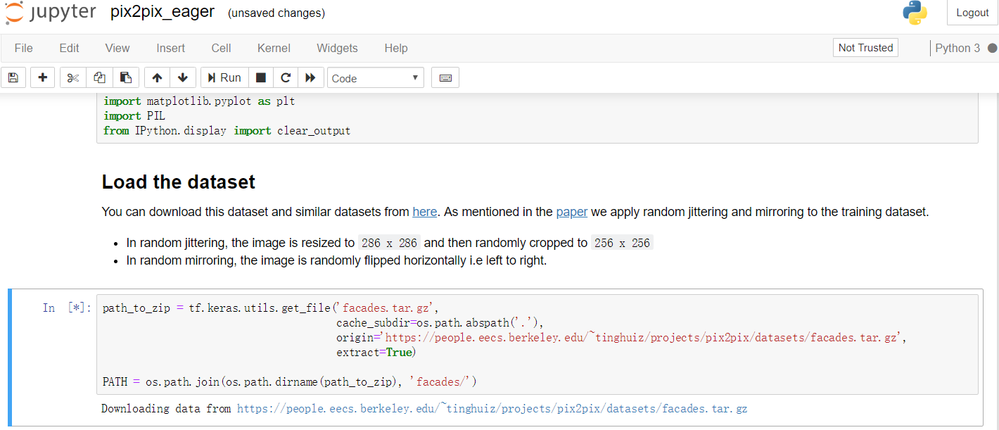
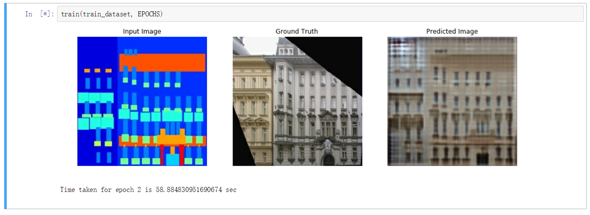

# <a id="scenario-1"></a> 场景一：Docker 容器中使用本地节点GPU资源

本章中我们用到的节点配置如下：
* 单台工作站，配备一张NVIDIA GTX 1080Ti显卡，显存11GB
* Ubuntu 16.04 LTS
* Docker CE 18.09

完成Orion vGPU软件部署后，我们将在普通的Docker容器（没有将物理GPU直通进容器内部，不依赖于`nvidia-docker`）中启动 Juypter Notebook，运行TensorFlow1.12，使用Orion vGPU资源进行 pix2pix 模型训练与推理。

<div align=center>


</div>

进入后续步骤之前，我们假设：
* Orion Server和Orion Client均为最新版本
* Orion Server已经根据[Orion Server安装部署](README.md#server)小节成功安装
* Orion Controller已经根据[Orion Controller安装部署](README.md#controller)小节安装并正常启动

## **Orion Server 配置与启动**
正如[Orion Server服务配置](README.md#server-config)中所介绍的，我们需要配置`/etc/orion/server.conf`文件中的两类属性：

* Orion Server所接受的与Client通信的数据通路，即`bind_addr`
* Orion Server运行的模式
  
### Orion Server数据通路设置

属性`bind_addr`指Orion Server所接受的数据通路，Client必须要能访问这一地址。对于本地容器环境来说，最简单的方法是在`docker run`的时候带上`--net host`参数，使得容器内部和物理机共享网络环境。此时，`bind_addr`使用默认的`127.0.0.1`即可。

当然，这样的便利性是建立在牺牲容器和操作系统之间网络隔离的基础上。感兴趣的读者可以参考本场景最后一小节[使用独立Docker子网](#docker-native)，在不使用`--net host`参数的情况下在容器中使用Orion vGPU资源。

### Orion Server模式设置

对于本地虚拟化环境，性能最佳的选择是通过共享内存来实现数据传输。为此，我们需要将`enable_shm`设置为`true`，并将`enable_rdma`设为`false`。

此外，由于我们是容器环境，所以`enable_kvm`应当设为`false`。

### 启动Orion Server

根据上述讨论，`/etc/orion/server.conf`文件中的`[server]`小节参考配置如下（即默认值）：

```bash
[server]
    listen_port = 9960
    bind_addr = 127.0.0.1
    enable_shm = "true"
    enable_rdma = "false"
    enable_kvm = "false
```

更改了配置文件后，我们启动/重启Orion Server服务：

```bash
systemctl restart oriond
```

此时，我们可以使用`orion-check`工具检查Orion vGPU软件的状态：

```bash
orion-check runtime server
```

```bash
# (omit output)
Checking Orion Server status ...
Orion Server is running with Linux user   : root
Orion Server is running with command line : /usr/bin/oriond 
Enable SHM                              [Yes]
Enable RDMA                             [No]
Enable Local QEMU-KVM with SHM          [No]
Binding IP Address :                    127.0.0.1
Listening Port :                        9960

Testing the Orion Server network ...
Orion Server can be reached through 127.0.0.1:9960
# (omit output)
Orion Controller addrress is set as 127.0.0.1:9123 in configuration file. Using this address to diagnose Orion Controller
Address 127.0.0.1:9123 is reached.
Orion Controller Version Infomation : api_version=0.1,data_version=0.1
There are 4 vGPU under managered by Orion Controller. 4 vGPU are free now.
```

正常情况下，每块物理GPU会被虚拟化为4块Orion vGPU，它们都应该处于可用的状态。


## **为Orion Client创建用于通信的共享内存**

为了Orion Server和容器中的Client应用能够通过共享内存加速数据传输，我们需要在启动容器之前创建一块共享内存:

```bash
# From host OS
orion-shm
```

上述命令会在`/dev/shm`目录下创建一块`128MB`的共享内存`/dev/shm/orionsock0`，可以通过`ls /dev/shm/`命令检查。

需要注意的是：
    
* 如果删除或覆盖了已经被使用过的`/dev/shm/orionsock<id_num>` 共享内存，一定要重启Orion Server服务；

* 如果同时运行多个container，每个container需要挂载单独的`/dev/shm/orionsock<id_num>`共享内存。这些共享内存可以通过`orion-shm -i <id_num>`来分别创建。

**注** 如果用户阅读本文档时首先略过了这一步，直接执行了下面的`docker run`命令，那么`/dev/shm`下会创建一个`/dev/shm/orionsock0`的**目录**，导致这里`orion-shm`不能成功创建共享内存文件。这种情况下，用户需要手动删除这个同名目录。

## **Orion Client容器启动**

### 获取带有Orion Client运行时环境的容器

我们提供配置好Orion Client runtime的预先安装好官方原生TensorFlow 1.12的Docker镜像，以Python3.5版本为例：

```bash
docker pull virtaitech/orion-client:cu9.0-tf1.12-py3
```

有兴趣的读者可以参考我们的[Dockerfile](#)来构建自己的容器。

**注** 读者需要确保Docker镜像和Orion Server都是最新版本，不同版本之间的Orion Server和Orion Client无法共同工作。

### Orion Client端参数配置

对于Orion Client端容器来说，需要设置以下环境变量：
* `ORION_CONTROLLER=<controller_ip>:9123`: Orion Client向Orion Controller申请Orion vGPU资源时发送RESTful API的网络地址。在本场景中，容器共享操作系统网络，所以`controller_ip`可以设置为`127.0.0.1`即可。
* `ORION_VGPU`：容器中每个进程申请的Orion vGPU数目，默认情况下，最多可以申请4倍物理GPU数目的vGPU。本例中我们设置`ORION_VGPU=1`。
* `ORION_GMEM`：申请的每个Orion vGPU所能使用的显存数目（单位：MB）。由于我们使用一张GTX 1080Ti显卡，显存上限为11G，我们设置`ORION_GMEM=10500`。

### 启动容器

**我们假设用户已经成功创建`/dev/shm/orionsock0`共享内存**

如上文所述，我们在用`docker run`命令启动容器时，需要用`-e`参数设置上一节介绍的环境变量，并用`-v`参数将创建的`/dev/shm/orionsock0`共享内存挂载到容器内的`/dev/shm`目录下。

为了方便运行Jupyter Notebook训练TensorFlow官方提供的`pix2pix`模型例子，我们假设用户已经将[pix2pix模型的Jupyter Notebook文件](https://github.com/tensorflow/tensorflow/blob/r1.12/tensorflow/contrib/eager/python/examples/pix2pix/pix2pix_eager.ipynb)保存到执行`docker run`的目录下。

**注意** 直接用`wget <url/to/pix2pix_eager.ipynb>`命令所下载到的并不是真正的Jupyter Notebook文件，而是一个html文件。用户可能需要将整个TensorFlow repo下载到本地，再将`pix2pix_eager.ipynb`放到工作目录下。

```bash
docker run -it --rm \
    -v /dev/shm/orionsock0:/dev/shm/orionsock0:rw \
    -v $(pwd)/pix2pix_eager.ipynb:/root/pix2pix_eager.ipynb \
    --net host \
    -e ORION_CONTROLLER=127.0.0.1:9123 \
    -e ORION_VGPU=1 \
    -e ORION_GMEM=10500 \
    virtaitech/orion-client:cu9.0-tf1.12-py3
```

读者可以在容器中通过`ls /dev | grep nvidia`确认容器中没有挂载NVIDIA显卡设备。

在运行Jupyter Notebook之前，我们可以用`orion-check`工具检查Orion Client容器内部是否能正常与Orion Controller通信：

```bash
# From inside Orion Client container
orion-check runtime client
```

正常情况下，输出应该是：

```bash
# (omit output)
Environment variable ORION_CONTROLLER is set as 127.0.0.1:9123 Using this address to diagnose Orion Controller.
Orion Controller Version Infomation : data_version=0.1,api_version=0.1
There are 4 vGPU under managered by Orion Controller. 4 vGPU are free now.
```

这样的输出说明Orion Client容器内部应用可以向Orion Controller申请资源。否则，用户应该先根据[Orion Controller安装部署](README.md#controller)章节检查Orion Controller的状态，再根据上文检查是否设置了正确的`ORION_CONTROLLER=<controller_ip>:9123`。

## **运行Jupyter Notebook**

```bash
# From inside Orion Client container
jupyter notebook --ip=0.0.0.0 --no-browser --allow-root
```

会看到类似于下面的输出：

```bash
[I 10:14:05.850 NotebookApp] Writing notebook server cookie secret to /root/.local/share/jupyter/runtime/notebook_cookie_secret
[I 10:14:06.545 NotebookApp] Serving notebooks from local directory: /root
[I 10:14:06.545 NotebookApp] The Jupyter Notebook is running at:
[I 10:14:06.545 NotebookApp] http://(hostname or 127.0.0.1):8888/?token=58a67eb5acdf176290cd9649f800a25d68d87637b229baf3
[I 10:14:06.545 NotebookApp] Use Control-C to stop this server and shut down all kernels (twice to skip confirmation).
[C 10:14:06.548 NotebookApp]

    To access the notebook, open this file in a browser:
        file:///root/.local/share/jupyter/runtime/nbserver-16-open.html
    Or copy and paste one of these URLs:
        http://(hostname or 127.0.0.1):8888/?token=<some-random-token>
```

如果用户可以使用这台机器的图形界面，那么可以打开浏览器，输入所提示地址。

否则，可以在有图形界面（能打开浏览器）的本地节点（例如笔记本电脑）上进行SSH端口转发：

```bash
ssh -Nf -L 8888:localhost:8888 <username@client-machine>
```

然后在本地浏览器里面输入`localhost:8888/?token=<some-random-token>`地址（将`<some-random-token>`替换成Jupyter Notebook所输出的实际token）访问Jupyter Notebook。


## **使用TensorFlow 1.12 Eager Execution模式进行 pix2pix 模型训练与推理**

打开`pix2pix_eager.ipynb`，通过点击菜单栏下方的Run按钮，依次执行每一个Cell（每一次点击只会执行当前Cell）。其间会从Berkeley大学服务器上下载29MB的数据集[`facades.tar.gz`](https://people.eecs.berkeley.edu/~tinghuiz/projects/pix2pix/datasets/facades.tar.gz)。如果运行容器的节点上从海外服务器下载数据过慢，用户可能需要在别的节点下载数据集，下载完成后放置在容器运行节点上`pix2pix_eager.ipynb`所在目录下。



一步步执行下来，用户会最终开始训练过程：



训练的过程中，我们可以在容器外部通过`nvidia-smi`监视物理GPU的使用情况：


从图中可以看到，真正使用物理GPU的进程是Orion Server的进程`oriond`，而不是容器中正在执行TensorFlow训练任务的Python脚本。这是因为容器中的应用程序使用的是Orion vGPU资源，对物理GPU的访问完全由Orion Server所接管。

训练完200个epochs以后，可以在测试集上运行模型：


如果运行有异常，用户可以参考[附录相应小节](appendix.md#trouble-client)进行检查。

## <a id="docker-native"></a>（可选）使用独立的Docker子网

本小节中，我们展示当容器使用独立的Docker子网时应当如何设置各项参数。我们假定读者已经熟悉并成功完成了本章前面介绍的，当容器使用`--net host`参数启动时使用Orion vGPU的整套流程，因此在本小节中我们只列出与前文不同之处。

### Orion Server 数据通路设置

设置数据通路`bind_addr`的关键，在于确保Orion Client端可以通过这一地址与Orion Server进行数据交互。对于现在的场景，在容器内的应用默认只能访问Docker子网，所以我们需要把`bind_addr`设为Docker子网的网关（gateway）。

我们在物理机上运行`ifconfig`以检查网络设置。一般来说，Docker默认安装后建立的子网为`docker0`：

```bash
docker0   Link encap:Ethernet  HWaddr 02:42:46:9f:27:13  
          inet addr:172.17.0.1  Bcast:172.17.255.255  Mask:255.255.0.0
          inet6 addr: fe80::42:46ff:fe9f:2713/64 Scope:Link
          UP BROADCAST MULTICAST  MTU:1500  Metric:1
          RX packets:416541 errors:0 dropped:0 overruns:0 frame:0
          TX packets:652846 errors:0 dropped:0 overruns:0 carrier:0
          collisions:0 txqueuelen:0 
          RX bytes:24865042 (24.8 MB)  TX bytes:3116550526 (3.1 GB)
```

因此，我们应当设置`bind_addr`为`docker0`子网的网关`172.17.0.1`。

### Orion Server 参数配置示例

更新后的`/etc/orion/server.conf`文件中的`[server]`小节参考配置如下：

```bash
[server]
    listen_port = 9960
    bind_addr = 172.17.0.1
    enable_shm = "true"
    enable_rdma = "false"
    enable_kvm = "false
```

需要注意的是，若`oriond`之前已经启动，为了使配置文件生效，需要重启`oriond`服务：

```bash
systemctl restart oriond
```

### Orion Client 参数设置

这里我们将Orion Controller地址设置为Docker子网网关地址：`ORION_CONTROLLER=172.17.0.1:9123`，从而确保容器中的应用程序向Orion Controller发送的资源请求可以被Orion Controller收到。

### 运行容器

除了上述修改外，为了容器外部可以在浏览器中访问Jupyter Notebook，我们还需要将`8888`端口通过`-p 8888:8888`暴露到外部。最终启动容器的命令为：

```bash
docker run -it --rm \
    -v /dev/shm/orionsock0:/dev/shm/orionsock0:rw \
    -v $(pwd)/pix2pix_eager.ipynb:/root/pix2pix_eager.ipynb \
    -p 8888:8888 \
    -e ORION_CONTROLLER=172.17.0.1:9123 \
    -e ORION_VGPU=1 \
    -e ORION_GMEM=10500 \
    virtaitech/orion-client:cu9.0-tf1.12-py3
```

同样，我们需要在容器内部检查是否能向Orion Controller申请资源：

```bash
# From inside Orion Client container
orion-check runtime client
```

正常情况下，输出应该是：

```bash
# (omit output)
Environment variable ORION_CONTROLLER is set as 172.17.0.1:9123 Using this address to diagnose Orion Controller.
Orion Controller Version Infomation : data_version=0.1,api_version=0.1
There are 4 vGPU under managered by Orion Controller. 4 vGPU are free now.
```

这样的输出说明Orion Client容器内部应用可以向Orion Controller申请资源。否则，用户应该先根据[Orion Controller安装部署](README.md#controller)章节检查Orion Controller的状态，再根据上文检查是否设置了正确的`ORION_CONTROLLER=<controller_ip>:9123`。

注：在使用独立Docker子网时，可能会遇到防火墙相关问题，读者可以参考附录[防火墙设置](appendix.md#firewall)小节的内容进行检查和设置。