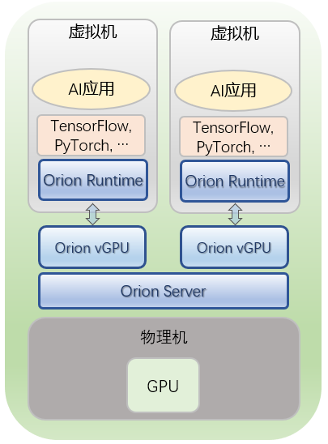
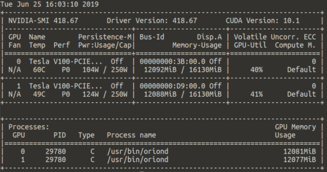

# <a id="scenario-2"></a> 场景二：KVM 虚拟机中使用本地节点GPU资源

本章中我们用到的节点配置如下：
* 单台服务器，配备两张NVIDIA Tesla V100计算卡，每张16GB显存
* Ubuntu Server 16.04 LTS
* Docker CE 18.09
* libvirt 1.3.1
* QEMU 2.5.0

我们以安装ubuntu16.04操作系统的一台虚拟机`ubuntu-client0`作为Orion Client。这台虚拟机既没有将物理机上的显卡以直通（Passthrough）的方式穿透进来，也没有安装NVIDIA驱动或CUDA组件。我们安装了必要的Python3库，以及TensorFlow 1.12 GPU版本：

```bash
# From inside VM
sudo apt install python3-dev python3-pip
sudo pip3 install tensorflow-gpu==1.12.0
```

由于虚拟机中不能访问GPU，也没有NVIDIA的软件环境，TensorFlow目前是无法使用的。在配置好Orion vGPU软件后，虚拟机中的TensorFlow就可以使用Orion vGPU进行模型的训练与推理。

完成Orion vGPU软件部署后，我们将在`ubuntu-client0`中运行TensorFlow官方的CIFAR10_Estimator示例，使用两块Orion vGPU （分别位于两块物理GPU上）进行模型训练与推理。

<div align=center>



</div>
  
进入后续步骤之前，我们假设：
* Orion Server已经根据[Orion Server安装部署](README.md#server)小节成功安装
* Orion Controller已经根据[Orion Controller安装部署](README.md#controller)小节安装并正常启动


## **Orion Server 配置启动**

在启动Orion Server服务之前，我们需要修改配置文件，设置数据通路，并打开Orion Server对KVM的支持。

### 数据通路设置

属性`bind_addr`指Orion Server所接受的数据通路，Client必须要能访问这一地址。对于KVM虚拟机来说，我们需要将其设置为KVM虚拟机网络的网关地址。

我们使用`virsh`查看KVM虚拟机的网络配置：

```bash
# From host OS
sudo virsh domifaddr ubuntu-client0
```


```bash
 Name       MAC address          Protocol     Address
-------------------------------------------------------------------------------
 vnet1      52:54:00:04:82:10    ipv4         33.31.0.10/24
```

可以看到，当前KVM虚拟机的IP地址为`33.31.0.10`，因此应该设置`bind_addr=33.31.0.1`。

附：如果KVM虚拟机在多个虚拟子网内，例如：

```bash
 Name       MAC address          Protocol     Address
-------------------------------------------------------------------------------
 vnet0      52:54:00:04:82:10    ipv4         33.31.0.10/24
 vnet1      52:54:00:c5:43:10    ipv4         33.32.0.10/24
```

选择任意一个子网的网关作为`bind_addr`均可。

### Orion Server模式设置

本场景中，我们仍然选择本地共享内存来加速数据传输，因此需要设置`enable_shm=true`，`enable_rdma=false`。此外，我们要显式启用Orion vGPU软件对KVM虚拟机的支持，即设置`enable_kvm=true`。

### Orion Server 参数配置示例
本场景中，`/etc/orion/server.conf`的第一小节内容应该配置为
```bash
[server]
    listen_port = 9960                                                          
    bind_addr = 33.31.0.1 
    enable_shm = "true"
    enable_rdma = "false"
    enable_kvm = "true"
```

### 启动Orion Server
我们需要重启Orion Server使新配置生效，并通过`orion-check`工具进一步确认Orion Server和Orion Controller可以正常交互：

```bash
# From host OS
sudo systemctl restart oriond 
sudo orion-check runtime server
```

正常的输出类似下面所示：

``` bash
Searching NVIDIA GPU ...
CUDA driver 418.67
418.67 is installed.
2 NVIDIA GPUs are found :
    0 : Tesla V100-PCIE-16GB
    1 : Tesla V100-PCIE-16GB

Checking NVIDIA MPS ...
NVIDIA CUDA MPS is off.

Checking Orion Server status ...
Orion Server is running with Linux user   : root
Orion Server is running with command line : /usr/bin/oriond 
Enable SHM                              [Yes]
Enable RDMA                             [No]
Enable Local QEMU-KVM with SHM          [Yes]
Binding IP Address :                    33.31.0.1
Listening Port :                        9960

Testing the Orion Server network ...
Orion Server can be reached through 33.31.0.1:9960

Checking Orion Controller status ...
[Info] Orion Controller setting may be different in different SHELL.
[Info] Environment variable ORION_CONTROLLER has the first priority.

Orion Controller addrress is set as 127.0.0.1:9123 in configuration file. Using this address to diagnose Orion Controller
Address 127.0.0.1:9123 is reached.
Orion Controller Version Infomation : data_version=0.1,api_version=0.1
There are 8 vGPU under managered by Orion Controller. 8 vGPU are free now.
```

可以看到，我们的Orion Server节点上有两块Tesla V100计算卡，Orion Controller将它们虚拟化成了一共8块Orion vGPU。

## <a id="scenario-2-install-client"></a>在虚拟机内安装Orion Client运行时

### 安装至默认路径

在虚拟机中，我们运行Orion Client安装包：

```bash
# From inside VM
sudo ./install-client
```

此时，用户没有指定安装路径，安装包会询问是否将Orion Client运行时安装到默认路径`/usr/lib/orion`下。得到用户许可后，安装包会通过`ldconfig`机制将Orion Client运行时添加到操作系统动态库搜索路径。

```bash
Orion client environment will be installed to /usr/lib/orion
Do you want to continue [n/y] ?y

Configuration file is generated to /etc/orion/client.conf
Please edit the "controller_addr" setting and make it point to the controller address in your environment.

Orion vGPU client environment has been installed in /usr/lib/orion
To run application with Orion vGPU environment, please make sure Orion environment is loaded. e.g.
export LD_LIBRARY_PATH=/usr/lib/orion:$LD_LIBRARY_PATH
```

由于安装包已经配置搜索路径，这里屏幕提示的`export LD_LIBRARY_PATH=<installation-path>:$LD_LIBRARY_PATH`不是必需的。

### （可选）安装至自定义路径
以安装到`/orion`为例：

```bash
# From inside VM
INSTALLATION_PATH=/orion
sudo mkdir -p $INSTALLATION_PATH
sudo ./install-client -d $INSTALLATION_PATH
```
这种情形下，安装包会直接将Orion Client运行时安装到用户指定的`INSTALLATION_PATH=/orion`路径下，并向屏幕输出下列提示：

```bash
Configuration file is generated to /etc/orion/client.conf
Please edit the "controller_addr" setting and make it point to the controller address in your environment.

Orion vGPU client environment has been installed in /orion
To run application with Orion vGPU environment, please make sure Orion environment is loaded. e.g.
export LD_LIBRARY_PATH=/orion:$LD_LIBRARY_PATH
```

用户在terminal内运行应用程序之前，一定要保证Orion Client运行时在操作系统动态库搜索路径中：

```bash
# From current working terminal inside VM
export LD_LIBRARY_PATH=/usr/local/orion:$LD_LIBRARY_PATH
```

注意这条命令只对当前terminal生效。为方便起见，用户可以将上述语句加至`~/.bashrc`的最后一行，然后用`source ~/.bashrc`使其生效，此后登录虚拟机便不需要反复设置。


## Orion Client参数配置

正如[使用Docker容器](#container.md)中所介绍的，Orion Client端需要向Orion Controller发送对Orion vGPU资源的申请。对于容器环境，我们是通过在启动容器时用`ORION_CONTROLLER=<controller_ip>:9123`环境变量设置Orion Controller的地址。对于KVM虚拟机来说，我们可以更改`/etc/orion/client.conf`来达到参数配置的目的。

由于Orion Controller监听在物理机上的`0.0.0.0:9123`上，我们将`controller_addr`设置为虚拟机子网网关地址即可：

```bash
[controller]
    controller_addr = 33.31.0.1:9123
```

设置完后，我们用`orion-check`工具检查状态：

```bash
# From inside VM
orion-check runtime client
```

如果Orion Client虚拟机内部可以连接到Orion Controller，输出为：

```bash
# (omit output)
Orion Controller addrress is set as 33.31.0.1:9123 in configuration file. Using this address to diagnose Orion Controller
Address 33.31.0.1:9123 is reached.
Orion Controller Version Infomation : data_version=0.1,api_version=0.1
There are 8 vGPU under managered by Orion Controller. 8 vGPU are free now.
```

## 运行TF官方CIFAR10_Estimator示例

在运行应用程序之前，我们用环境变量指定应用程序向Orion Controller申请的Orion vGPU数目与显存：

```bash
export ORION_VGPU=2
export ORION_GMEM=12000
```

我们的每一块Tesla V100计算卡有16GB显存，因此如果用户将`ORION_GMEM`设置得少于8GB，两块Orion vGPU会被调度到同一块物理GPU上。这里我们设置Orion vGPU的显存为12000MB，那么两块Orion vGPU将分别调度到两块物理GPU上，方便我们展示双卡的模型训练。

下面我们使用TensorFlow官方的CIFAR10 Estimator例子展示模型的训练与推理：
https://github.com/tensorflow/models/blob/master/tutorials/image/cifar10_estimator/README.md

首先，我们`git clone`TF官方模型repo:

```bash
# From inside VM
git clone --branch=r1.12.0 https://github.com/tensorflow/models
```

然后进入CIFAR10 Estimator文件夹内

```bash
cd models/tutorials/image/cifar10_estimator/
```

读者第一次训练模型前，需要下载CIFAR10数据集并转换为TFRecord格式：

```bash
mkdir data
python3 generate_cifar10_tfrecords.py --data-dir ./data
```

处理好后，`data`目录应该包括以下内容，共520MB：

```bash
user@ubuntu-client0:~/models/tutorials/image/cifar10_estimator/data$ ls
cifar-10-batches-py  cifar-10-python.tar.gz  eval.tfrecords  train.tfrecords  validation.tfrecords
```

下面我们使用两块Orion vGPU进行模型训练，每块Orion vGPU上的batch_size设为128，总共256：

```bash
python3 cifar10_main.py \
	--data-dir=${PWD}/data \
	--job-dir=/tmp/cifar10 \
	--variable-strategy=GPU \
	--num-gpus=2 \
	--train-steps=10000 \
	--train-batch-size=256 \
	--learning-rate=0.1
```

TensorFlow打印的日志如下：

```bash
VirtaiTech Resource. Build-cuda-7675815-20190624_081551
2019-06-25 15:43:43.493814: I tensorflow/stream_executor/cuda/cuda_gpu_executor.cc:964] successful NUMA node read from SysFS had negative value (-1), but there must be at least one NUMA node, so returning NUMA node zero
2019-06-25 15:43:43.493882: I tensorflow/core/common_runtime/gpu/gpu_device.cc:1432] Found device 0 with properties: 
name: Tesla V100-PCIE-16GB major: 7 minor: 0 memoryClockRate(GHz): 1.38
pciBusID: 0000:00:09.0
totalMemory: 11.72GiB freeMemory: 11.72GiB
2019-06-25 15:43:43.604945: I tensorflow/stream_executor/cuda/cuda_gpu_executor.cc:964] successful NUMA node read from SysFS had negative value (-1), but there must be at least one NUMA node, so returning NUMA node zero
2019-06-25 15:43:43.605002: I tensorflow/core/common_runtime/gpu/gpu_device.cc:1432] Found device 1 with properties: 
name: Tesla V100-PCIE-16GB major: 7 minor: 0 memoryClockRate(GHz): 1.38
pciBusID: 0000:00:09.0
totalMemory: 11.72GiB freeMemory: 11.72GiB
2019-06-25 15:43:43.606527: I tensorflow/core/common_runtime/gpu/gpu_device.cc:1511] Adding visible gpu devices: 0, 1
2019-06-25 15:43:43.606568: I tensorflow/core/common_runtime/gpu/gpu_device.cc:982] Device interconnect StreamExecutor with strength 1 edge matrix:
2019-06-25 15:43:43.606577: I tensorflow/core/common_runtime/gpu/gpu_device.cc:988]      0 1 
2019-06-25 15:43:43.606582: I tensorflow/core/common_runtime/gpu/gpu_device.cc:1001] 0:   N Y 
2019-06-25 15:43:43.606589: I tensorflow/core/common_runtime/gpu/gpu_device.cc:1001] 1:   Y N 
2019-06-25 15:43:43.606657: I tensorflow/core/common_runtime/gpu/gpu_device.cc:1115] Created TensorFlow device (/device:GPU:0 with 11400 MB memory) -> physical GPU (device: 0, name: Tesla V100-PCIE-16GB, pci bus id: 0000:00:09.0, compute capability: 7.0)
2019-06-25 15:43:43.607202: I tensorflow/core/common_runtime/gpu/gpu_device.cc:1115] Created TensorFlow device (/device:GPU:1 with 11400 MB memory) -> physical GPU (device: 1, name: Tesla V100-PCIE-16GB, pci bus id: 0000:00:09.0, compute capability: 7.0)
# (omit output)
INFO:tensorflow:global_step/sec: 14.2797
INFO:tensorflow:loss = 0.48649728, step = 9900 (7.003 sec)
INFO:tensorflow:learning_rate = 0.1, loss = 0.48649728 (7.003 sec)
INFO:tensorflow:Average examples/sec: 3639.99 (4009.58), step = 9900
INFO:tensorflow:Average examples/sec: 3640.07 (3717.26), step = 9910
INFO:tensorflow:Average examples/sec: 3640.09 (3655.01), step = 9920
INFO:tensorflow:Average examples/sec: 3640.31 (3873.63), step = 9930
INFO:tensorflow:Average examples/sec: 3640.45 (3788.08), step = 9940
INFO:tensorflow:Average examples/sec: 3640.79 (4017.58), step = 9950
INFO:tensorflow:Average examples/sec: 3641.19 (4089.74), step = 9960
INFO:tensorflow:Average examples/sec: 3641.23 (3679.08), step = 9970
INFO:tensorflow:Average examples/sec: 3641.43 (3847.37), step = 9980
INFO:tensorflow:Average examples/sec: 3641.4 (3615.53), step = 9990
INFO:tensorflow:Saving checkpoints for 10000 into /tmp/cifar10/model.ckpt.
INFO:tensorflow:Loss for final step: 0.46667284.
# (omit output)
INFO:tensorflow:Evaluation [100/100]
INFO:tensorflow:Finished evaluation at 2019-06-25-08:06:14
INFO:tensorflow:Saving dict for global step 10000: accuracy = 0.7628, global_step = 10000, loss = 1.0683168
INFO:tensorflow:Saving 'checkpoint_path' summary for global step 10000: /tmp/cifar10/model.ckpt-10000
2019-06-25 16:06:15 [INFO] Client exits with allocation ID fda38164-711b-4809-9984-2759a3a2165b
```

从日志中可以看到：

* 应用程序启动时，Orion Client运行时会打印日志`VirtaiTech Resource. Build-cuda-xxx`。这一行日志说明应用程序成功加载了Orion Client运行时。
* 应用程序退出时，Orion Client运行时会打印日志`Client exits with allocation ID xxx`。这一行日志说明应用程序在生命周期里成功向Orion Controller申请到了Orion vGPU资源，退出时释放这一资源。
* TensorFlow启动时识别出了两块GPU，显存各自为11.72GB （对应于我们设置的`ORION_GMEM=12000`）

模型训练的过程中，我们在物理机操作系统中运行`nvidia-smi`查看物理GPU使用情况：



从结果中可以看出：

* 对物理GPU的访问被Orion Server进程`oriond`完全接管
* 两块Orion vGPU被调度到了两块物理GPU上
* 我们限制了Orion vGPU对显存的占用

如果运行有异常，用户可以参考[附录相应小节](appendix.md#trouble-client)进行检查。