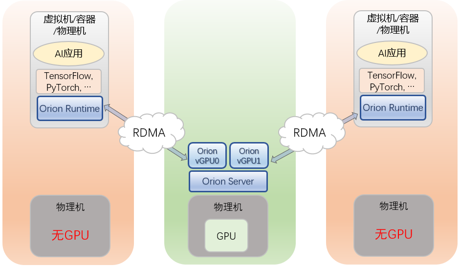
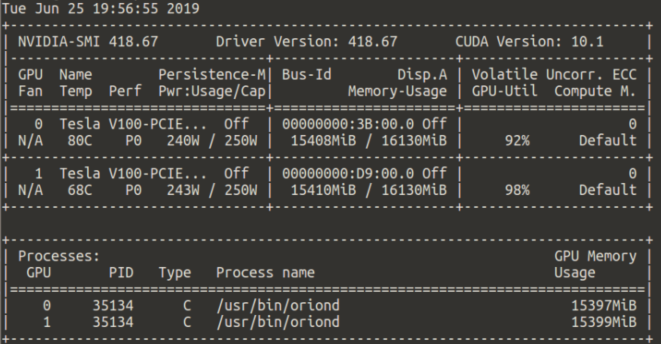

# <a id="scenario-3"></a>场景三：在没有GPU的节点上使用远程节点GPU资源

本章中我们用到的环境配置如下：
* 两台服务器，其中一台（`server1`）配备两张NVIDIA Tesla V100计算卡，每张16GB显存；另一台（`server0`）没有配备物理GPU
* 两台服务器上均配备Mellanox ConnectX-5 25Gb网卡，通过光交换机互相连接
* MLNX_OFED_LINUX04.5.2驱动及用户库
* Ubuntu Server 16.04 LTS

我们将Orion Server和Orion Controller均部署在配备有物理GPU的`server1`上，将`server0`作为Orion Client。我们在`server0`上安装了必要的Python3库以及TensorFlow 1.12 GPU版本：

```bash
# On server0 (which has no GPU)
sudo apt install python3-dev python3-pip
sudo pip3 install tensorflow-gpu==1.12.0
```

`server0`上没有物理GPU，也没有NVIDIA的软件环境，因此TensorFlow并不能使用GPU加速训练。一旦Orion vGPU软件部署完成，我们就可以在`server0`上运行TensorFlow通过Orion vGPU加速模型训练。我们会将TensorFlow official benchmark运行在随机生成数据、真实Imagenet数据两种场景下。

<div align=center>



</div>
  
进入后续步骤之前，我们假设：
* Orion Server已经根据[Orion Server安装部署](README.md#server)小节成功安装在`server1`上
* Orion Controller已经根据[Orion Controller安装部署](README.md#controller)小节安装在`server1`上并正常启动

## Orion Server 参数配置

在启动`server1`上的Orion Server服务前，我们需要修改配置文件，设置数据通路使得`server0`上的Orion Client可以连接到Orion Server；此外，我们需要关闭默认的共享内存模式，打开RDMA通道。

### 数据通路设置

由于我们要使用RDMA加速数据交换，我们应该将`bind_addr`设置为Orion Client在RDMA网段可以访问的地址。以本场景环境为例，两台服务器节点所在的RDMA网段为`192.168.25.xxx`，因此我们将`bind_addr`设置为Orion Server所在`server1`的RDMA网段地址`192.168.25.21`。

### Orion Server模式设置
我们选择RDMA加速数据传输，因此需要设置`enable_shm=false`，`enable_rdma=true`。此外，我们的Orion Client并非本地KVM虚拟机，因此我们要设置`enable_kvm=false`。

### Orion Server 参数配置示例
本场景中，`/etc/orion/server.conf`的第一小节内容应该配置为
```bash
[server]
    listen_port = 9960                                                          
    bind_addr = 192.168.25.21 
    enable_shm = "false"
    enable_rdma = "true"
    enable_kvm = "false"
```

### 启动Orion Server
我们需要重启Orion Server使新配置生效，并检查状态：

```bash
# From server1
sudo systemctl restart oriond

sudo orion-check runtime server
```

正常的输出如下：

```bash
Searching NVIDIA GPU ...
CUDA driver 418.67
418.67 is installed.
2 NVIDIA GPUs are found :
    0 : Tesla V100-PCIE-16GB
    1 : Tesla V100-PCIE-16GB

Checking NVIDIA MPS ...
NVIDIA CUDA MPS is off.

Checking Orion Server status ...
Orion Server is running with Linux user   : root
Orion Server is running with command line : /usr/bin/oriond 
Enable SHM                              [No]
Enable RDMA                             [Yes]
Enable Local QEMU-KVM with SHM          [No]
Binding IP Address :                    192.168.25.21
Listening Port :                        9960

Testing the Orion Server network ...
Orion Server can be reached through 192.168.25.21:9960

Checking Orion Controller status ...
[Info] Orion Controller setting may be different in different SHELL.
[Info] Environment variable ORION_CONTROLLER has the first priority.

Orion Controller addrress is set as 127.0.0.1:9123 in configuration file. Using this address to diagnose Orion Controller
Address 127.0.0.1:9123 is reached.
Orion Controller Version Infomation : data_version=0.1,api_version=0.1
There are 8 vGPU under managered by Orion Controller. 8 vGPU are free now.
```

表明Orion Controller将两块物理GPU一共虚拟成了8块Orion vGPU，目前均处于可用状态。

## 安装Orion Client运行时

### 安装至默认路径

在`server0`中，我们运行Orion Client安装包：

```bash
# From inside server0
sudo ./install-client
```

此时，用户没有指定安装路径，安装包会询问是否将Orion Client运行时安装到默认路径`/usr/lib/orion`下。得到用户许可后，安装包会通过`ldconfig`机制将Orion Client运行时添加到操作系统动态库搜索路径。

```bash
Orion client environment will be installed to /usr/lib/orion
Do you want to continue [n/y] ?y

Configuration file is generated to /etc/orion/client.conf
Please edit the "controller_addr" setting and make it point to the controller address in your environment.

Orion vGPU client environment has been installed in /usr/lib/orion
To run application with Orion vGPU environment, please make sure Orion environment is loaded. e.g.
export LD_LIBRARY_PATH=/usr/lib/orion:$LD_LIBRARY_PATH
```

由于安装包已经配置搜索路径，这里屏幕提示的`export LD_LIBRARY_PATH=<installation-path>:$LD_LIBRARY_PATH`不是必需的。

### （可选）安装至自定义路径
以安装到`/orion`为例：

```bash
# From inside server0
INSTALLATION_PATH=/orion
sudo mkdir -p $INSTALLATION_PATH
sudo ./install-client -d $INSTALLATION_PATH
```
这种情形下，安装包会直接将Orion Client运行时安装到用户指定的`INSTALLATION_PATH=/orion`路径下，并向屏幕输出下列提示：

```bash
Configuration file is generated to /etc/orion/client.conf
Please edit the "controller_addr" setting and make it point to the controller address in your environment.

Orion vGPU client environment has been installed in /orion
To run application with Orion vGPU environment, please make sure Orion environment is loaded. e.g.
export LD_LIBRARY_PATH=/orion:$LD_LIBRARY_PATH
```

用户在terminal内运行应用程序之前，一定要保证Orion Client运行时在操作系统动态库搜索路径中：

```bash
# From current working terminal inside server0
export LD_LIBRARY_PATH=/usr/local/orion:$LD_LIBRARY_PATH
```

注意这条命令只对当前terminal生效。为方便起见，用户可以将上述语句加至`~/.bashrc`的最后一行，然后用`source ~/.bashrc`使其生效，此后以当前用户身份登录`server0`不需要反复设置。


## Orion Client参数配置

Orion Client端需要向Orion Controller发送对Orion vGPU资源的申请。我们可以更改`/etc/orion/client.conf`来达到参数配置的目的。

由于Orion Controller监听在`server1`上的`0.0.0.0:9123`上，我们将`controller_addr`设置为`server1`的任意一个从`server0`能够访问的IP地址即可。此处我们可以依旧使用RDMA网段的地址`192.168.25.21`，或者使用`server1`的一个TCP地址`10.10.1.21`。我们选择后者作为示范。

```bash
[controller]
    controller_addr = 10.10.1.21:9123
```

设置完后，我们用`orion-check`工具检查状态：

```bash
# From inside server0
orion-check runtime client
```

如果Orion Client `server0`内部可以连接到Orion Controller，输出为：

```bash
# (omit output)
Orion Controller addrress is set as 10.10.1.21:9123 in configuration file. Using this address to diagnose Orion Controller
Address 10.10.1.21:9123 is reached.
Orion Controller Version Infomation : data_version=0.1,api_version=0.1
There are 8 vGPU under managered by Orion Controller. 8 vGPU are free now.
```

## <a id="run-benchmarks"></a>运行TF Official Benchmark
在`server0`上运行应用程序之前，我们用环境变量指定应用程序向Orion Controller申请的Orion vGPU数目与显存：

```bash
export ORION_VGPU=2
export ORION_GMEM=15500
```

我们的每一块Tesla V100计算卡有16GB显存，因此如果用户将`ORION_GMEM`设置得少于8GB，两块Orion vGPU会被调度到同一块物理GPU上。这里我们设置Orion vGPU的显存为15500MB，那么两块Orion vGPU将分别调度到两块物理GPU上，方便我们展示双卡的模型训练。

首先，我们将TF official benchmark repo克隆下来：

```bash
# From inside server0
git clone --branch=cnn_tf_v1.12_compatible https://github.com/tensorflow/benchmarks.git
```

TF official benchmark支持两种运行模式：随机生成数据，或者用转换为TFRecord格式的Imagenet数据集。我们分别介绍这两种情形。

### 使用随机生成数据（Synthetic data)

下面的代码会使用两块Orion vGPU训练inception_v3模型，每块vGPU上的batch_size=128， 总batch_size为256。

对于随机数据来说，不可能提升训练精度，因此我们只训练500个batch即可：

```bash
python3 ./benchmarks/scripts/tf_cnn_benchmarks/tf_cnn_benchmarks.py \
	--data_name=imagenet \
	--model=inception3 \
	--optimizer=rmsprop \
	--num_batches=500 \
	--num_gpus=2 \
	--batch_size=128
```
输出为
```bash
VirtaiTech Resource. Build-cuda-7675815-20190624_081551
2019-06-25 19:55:37.099719: I tensorflow/core/common_runtime/gpu/gpu_device.cc:1432] Found device 0 with properties: 
name: Tesla V100-PCIE-16GB major: 7 minor: 0 memoryClockRate(GHz): 1.38
pciBusID: 0000:d9:00.0
totalMemory: 15.14GiB freeMemory: 15.14GiB
2019-06-25 19:55:37.218239: I tensorflow/core/common_runtime/gpu/gpu_device.cc:1432] Found device 1 with properties: 
name: Tesla V100-PCIE-16GB major: 7 minor: 0 memoryClockRate(GHz): 1.38
pciBusID: 0000:d9:00.0
totalMemory: 15.14GiB freeMemory: 15.14GiB
2019-06-25 19:55:37.222562: I tensorflow/core/common_runtime/gpu/gpu_device.cc:1511] Adding visible gpu devices: 0, 1
2019-06-25 19:55:37.222765: I tensorflow/core/common_runtime/gpu/gpu_device.cc:982] Device interconnect StreamExecutor with strength 1 edge matrix:
2019-06-25 19:55:37.222795: I tensorflow/core/common_runtime/gpu/gpu_device.cc:988]      0 1 
2019-06-25 19:55:37.222815: I tensorflow/core/common_runtime/gpu/gpu_device.cc:1001] 0:   N Y 
2019-06-25 19:55:37.222831: I tensorflow/core/common_runtime/gpu/gpu_device.cc:1001] 1:   Y N 
2019-06-25 19:55:37.222994: I tensorflow/core/common_runtime/gpu/gpu_device.cc:1115] Created TensorFlow device (/job:localhost/replica:0/task:0/device:GPU:0 with 14725 MB memory) -> physical GPU (device: 0, name: Tesla V100-PCIE-16GB, pci bus id: 0000:d9:00.0, compute capability: 7.0)
2019-06-25 19:55:37.225850: I tensorflow/core/common_runtime/gpu/gpu_device.cc:1115] Created TensorFlow device (/job:localhost/replica:0/task:0/device:GPU:1 with 14725 MB memory) -> physical GPU (device: 1, name: Tesla V100-PCIE-16GB, pci bus id: 0000:d9:00.0, compute capability: 7.0)
TensorFlow:  1.12
Model:       inception3
Dataset:     imagenet (synthetic)
Mode:        BenchmarkMode.TRAIN
SingleSess:  False
Batch size:  256 global
             128.0 per device
Num batches: 500
Num epochs:  0.10
Devices:     ['/gpu:0', '/gpu:1']
Data format: NCHW
Optimizer:   rmsprop
Variables:   parameter_server
==========
Generating training model
# (omit output)
Running warm up
Done warm up
Step	Img/sec	total_loss
1	images/sec: 442.6 +/- 0.0 (jitter = 0.0)	7.416
# (omit output)
490	images/sec: 434.6 +/- 1.2 (jitter = 19.5)	7.384
500	images/sec: 435.1 +/- 1.2 (jitter = 19.9)	7.378
----------------------------------------------------------------
total images/sec: 435.00
----------------------------------------------------------------
2019-06-25 20:01:06 [INFO] Client exits with allocation ID b928be93-0b40-4252-b6b4-291ca4c99462
```

从日志中可以看到：

* 应用程序启动时，Orion Client运行时会打印日志`VirtaiTech Resource. Build-cuda-xxx`。这一行日志说明应用程序成功加载了Orion Client运行时。
* 应用程序退出时，Orion Client运行时会打印日志`Client exits with allocation ID xxx`。这一行日志说明应用程序在生命周期里成功向Orion Controller申请到了Orion vGPU资源，退出时释放这一资源。
* TensorFlow启动时识别出了两块GPU，显存各自为15.14GB （对应于我们设置的`ORION_GMEM=15500`）

模型训练的过程中，我们在物理机操作系统中运行`nvidia-smi`查看物理GPU使用情况：



从结果中可以看出：

* 对物理GPU的访问被Orion Server进程`oriond`完全接管
* 两块Orion vGPU被调度到了两块物理GPU上
* 我们限制了Orion vGPU对显存的占用

### （可选）使用TFRecord格式的Imagenet数据集

首先，用户需要按照

https://github.com/tensorflow/models/tree/master/research/inception#getting-started

里的步骤下载Imagenet数据集，并转换成TFRecord格式。如果原始Imagenet数据集已经存储在本地，用户可以相应地修改脚本实现本地的格式转换。转换后的TFRecord文件一共有144GB。

下面的命令会使用两块Orion vGPU在真实Imagenet数据集上使用`rmsprop`优化器训练inception_v3模型，每块vGPU上的batch_size=128， 总batch_size为256。我们在全部训练集上训练5个完整的epoch，训练过程中的checkpoionts存储在`./train_dir`目录。

```bash
export IMAGENET_DIR=<your-path-to-imagenet-tfrecord>
python3 ./benchmarks/scripts/tf_cnn_benchmarks/tf_cnn_benchmarks.py \
	--data_dir=$IMAGENET_DIR \
	--data_name=imagenet \
	--print_training_accuracy=True \
	--train_dir=./train_dir \
	--save_model_steps=1000 \
	--eval_during_training_every_n_steps=5000 \
	--save_summaries_steps=1000 \
	--summary_verbosity=3 \
	--model=inception3 \
	--optimizer=rmsprop \
	--num_epochs=5 \
	--num_gpus=2 \
	--batch_size=128
```

TensorFlow向屏幕输出如下的日志：

```bash
VirtaiTech Resource. Build-cuda-7675815-20190624_081551
# (omit output)
TensorFlow:  1.12
Model:       inception3
Dataset:     imagenet
Mode:        BenchmarkMode.TRAIN_AND_EVAL
SingleSess:  False
Batch size:  256 global
             128.0 per device
Num batches: 25022
Num epochs:  5.00
Devices:     ['/gpu:0', '/gpu:1']
Data format: NCHW
Optimizer:   rmsprop
Variables:   parameter_server
==========
Generating training model
# (omit output)
Running warm up
Done warm up
Step	Img/sec	total_loss	top_1_accuracy	top_5_accuracy
1	images/sec: 318.7 +/- 0.0 (jitter = 0.0)	7.415	0.004	0.004
10	images/sec: 357.5 +/- 7.6 (jitter = 15.8)	7.364	0.000	0.000
# (omit output)
1490	images/sec: 370.6 +/- 0.3 (jitter = 7.9)	6.736	0.008	0.043
1500	images/sec: 370.6 +/- 0.3 (jitter = 7.9)	6.654	0.020	0.070
# (omit output)
24990	images/sec: 368.8 +/- 0.1 (jitter = 7.8)	3.411	0.352	0.613
25000	images/sec: 368.8 +/- 0.1 (jitter = 7.8)	3.493	0.344	0.629
Running evaluation at global_step 25010
# (omit output)
Accuracy @ 1 = 0.3692 Accuracy @ 5 = 0.6404 [249856 examples]
2019-06-26 01:49:26 [INFO] Client exits with allocation ID a2062e12-8199-4515-a8ec-59dfe9723b4d
```

可以看到`loss`不断下降，精度不断上升，最终在训练完5个epochs后达到36.92%的top-1精度，64.04%的top-5精度。训练过程中，每过5000个batch，TF会进行一次全面的evaluation。有兴趣的读者可以在`server0`上新打开terminal，运行TensorBoard从而在浏览器中监视训练过程：

```bash
# From inside server0
tensorboard --logdir ./train_dir
```

随后，在浏览器中访问`localhost:6006`即可（可能需要用ssh作端口转发，才能在有图形界面的终端访问）

如果运行有异常，用户可以参考[附录相应小节](appendix.md#trouble-client)进行检查。


## 附：确认Orion平台工作在RDMA模式下

如果Orion Server或者Orion Client端的RDMA驱动不能正常工作，或者Orion Server的`bind_addr`没有设置为RDMA网段的地址，Orion vGPU软件会自动切换成TCP模式进行数据传输。此时，性能会有明显下降。因此，我们需要通过Orion Server的日志来确认RDMA模式成功开启。

`server1`上，Orion Server的日志输出到`/var/log/orion/session`中。我们进到这个目录下，用`ll -rt`找到最新的日志文件：

```bash
# From inside server1
cd /var/log/orion/session
ll -rt
```

屏幕最下方的文件即为最新日志，我们查看它的内容：

``` bash
3686900184038864:	2019-06-25 20:24:52 [INFO] Resource successfully confirmed with controller
3686900190516972:	2019-06-25 20:24:52 [INFO] Resource successfully confirmed with controller
3686900190589780:	2019-06-25 20:24:52 [INFO] Final virtual gpu list <vID:pID:mbSize>: 0:0:15500,0:1:15500, begin to initialize CUDA device manager
3686904167685066:	2019-06-25 20:24:54 [INFO] Registered v-GPU 0 on p-GPU 0.
3686904167700354:	2019-06-25 20:24:54 [INFO] Registered v-GPU 0 on p-GPU 1.
3686904167738402:	2019-06-25 20:24:54 [INFO] Architecture initialization is done. Resource is confirmed.
3686904331240842:	2019-06-25 20:24:54 [INFO] Client supports RDMA mode, then server runs in RDMA mode.
3686904345514000:	2019-06-25 20:24:54 [INFO] Launching workers ...
```

说明Orion平台工作模式为RDMA。反之，如果日志中包含

```bash
[INFO] Client supports TCP mode, then server also falls back to TCP mode.
```

说明Orion平台工作模式退化为TCP，用户需要检查RDMA环境，以及Orion Server数据通路的设置。

如果Orion Server启动时，配置文件中的`enable_shm`和`enable_rdma`均为`false`，则Orion vGPU软件会默认工作在TCP模式，Orion Server日志中也不会有`Client supports XXX mode...`这行日志。